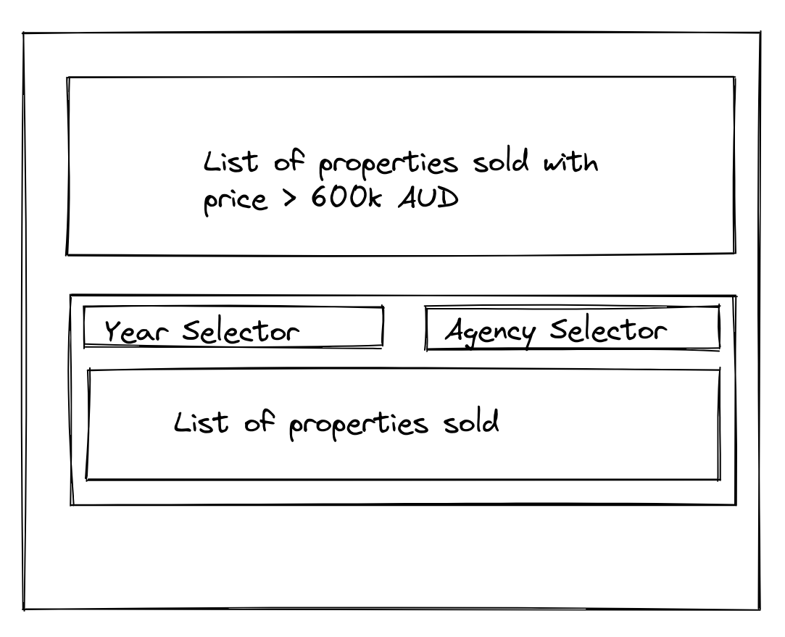

## Building the frontend app

### Pre-Requisite
- The `property-api` server is running on port 5000
- Scaffold a node project that lets you create a REST or GraphQL API (_preferred_), we do not care if you use Typescript or Javascript. Either one is ok.
- The `property-api` server handles CORS properly

### To-Do

- Based on the `property-api` as a datasoruce we want to create a simple aggregate api that can satisfy the following UI needs 
- Lets try and write the aggregate api in as production ready code as possible