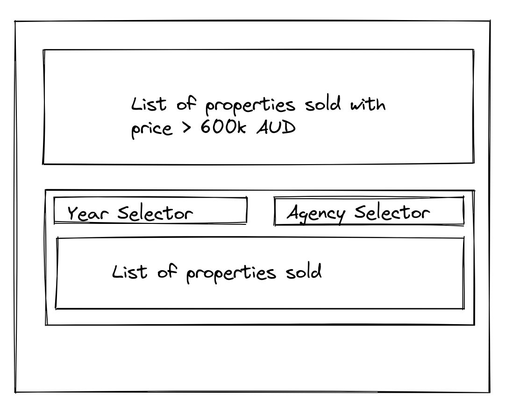

## Building the frontend app

### Pre-Requisite
- The `property-api` server is running on port 5000
- Scaffold a react application however you like, we do not care if you use Typescript or Javascript. Either one is ok.
- If using create-react-app set the following in your package.json for the front end to be able to communicate witht he `property-api`
```
"proxy" : "http://localhost:5000"
```
More documentation can be found [here](https://create-react-app.dev/docs/proxying-api-requests-in-development/)
The `property-api` server handles CORS properly

### To-Do

- Based on the data from the `property-api` we want to create a simple dashboard
- Lets try and build an frontend that captures the following UI requirements
